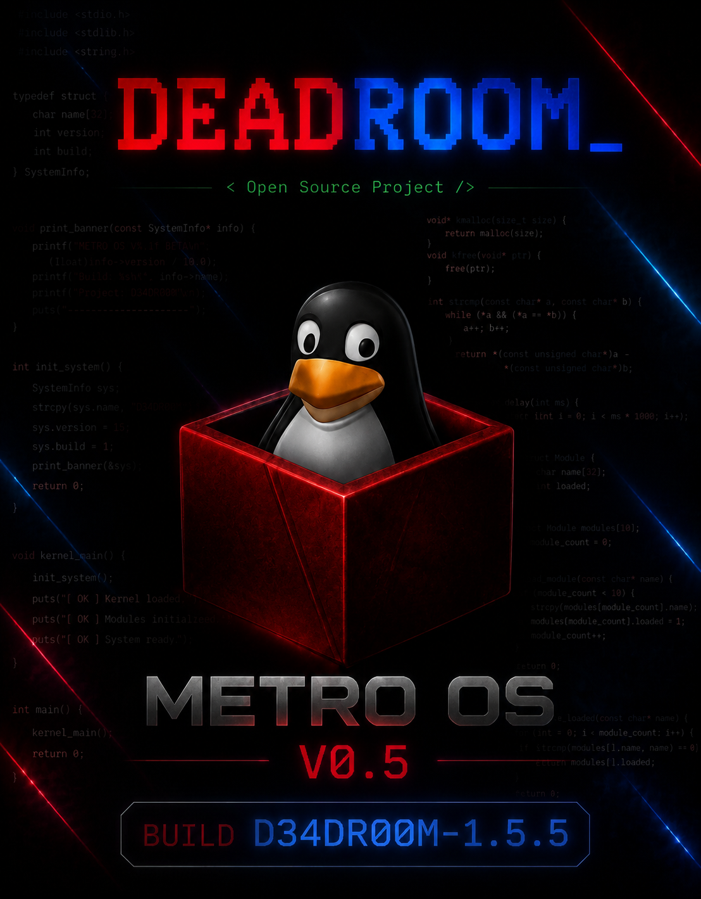

# METRO-OS
### VERSION v0.5 — BUILD ID: D34DR00M-1.5.5

METRO-OS is an experimental 32-bit x86 operating system written in C and x86 assembly. It boots from GRUB with the Multiboot protocol and provides a VGA-based command shell with basic system utilities, early architecture support, and a simple in-kernel filesystem layer.

---

## Poster



---

## Programmer


---

## Project Description

METRO-OS is designed for learning low-level operating system concepts. It demonstrates bootloader setup, VGA console output, keyboard input handling, interrupt/exception scaffolding, memory management, a simple shell, and a basic filesystem implementation.

---

## Current Feature Set

- Multiboot boot entry via GRUB
- 32-bit x86 kernel startup and basic architecture layer
- VGA console and keyboard input support
- Serial output support
- Memory manager and heap allocation
- Interrupt Descriptor Table (IDT) and ISR entry setup
- GDT, TSS, and paging scaffolding
- Uptime tracking and basic system commands
- Simple filesystem with disk-backed inode support

---

## Overview

- Bootloader: [boot/boot.asm](boot/boot.asm) implements the Multiboot entry point.
- Kernel: [kernel/kernel.c](kernel/kernel.c) initializes VGA, keyboard input, splash screen, shell runtime, and subsystem startup.
- Drivers: [drivers](drivers) contains VGA, keyboard, and serial console support.
- Commands: [commands](commands) implements built-in shell commands.
- Architecture: [arch/i386](arch/i386) contains x86-specific CPU, GDT, IDT, TSS, paging, and port I/O support.
- Filesystem: [fs](fs) contains a minimal disk and inode-based filesystem layer.
- Build: [Makefile](Makefile) compiles the kernel, creates an ISO, and launches QEMU.

---

## Built-in Shell Commands

- `help`               - show help menu
- `cls` / `clear`      - clear the screen
- `dir` / `ls`         - list available entries
- `cd <dir>`           - change directory
- `pwd` / `cmdlocate`  - show current directory
- `cat <file>`         - show file contents
- `ver`                - show OS version
- `mem`                - show memory information
- `time` / `date`      - show current RTC time
- `uptime`             - show system uptime
- `cpuinfo`            - show CPU vendor information
- `echo <text>`        - print text
- `copy <text>`        - print the given text
- `touch <file>`       - create a file entry
- `mkdir <dir>`        - create a directory entry
- `rmdir <dir>`        - remove a directory entry
- `rm <file>`          - remove a file entry
- `countdown <n>`      - print countdown from n
- `banner <text>`      - print banner text
- `restart`            - reboot the system
- `shutdown`           - halt the system

---

## Repository Structure

```text
METRO-OS/
├── arch/                  # x86/i386 architecture support
│   └── i386/
├── boot/                  # Multiboot startup code
│   └── boot.asm
├── commands/              # Shell command implementations
│   ├── cmd_copy.c
│   ├── cmd_mem.c
│   ├── cmd_time.c
│   └── sys_cmd.c
├── drivers/               # Hardware and console drivers
│   ├── keyboard.c
│   ├── keyboard.h
│   ├── serial.c
│   ├── serial.h
│   ├── vga.c
│   └── vga.h
├── errors/                # Error display routines
│   └── rsod.c
├── fs/                    # Minimal disk and inode filesystem layer
│   ├── disk.c
│   ├── disk.h
│   ├── inode.c
│   └── inode.h
├── img/                   # Project artwork and assets
├── kernel/                # Kernel entry, splash, shell, and command dispatch
│   └── kernel.c
├── lib/                   # Shared headers
│   └── types.h
├── memory/                # Simple kernel heap allocator
├── utils/                 # String and printf helpers
├── grub.cfg               # GRUB configuration for the ISO
├── linker.ld              # Linker script
├── Makefile               # Build and run commands
└── LICENCE                # MIT license text
```

---

## Build Requirements

- `nasm`
- `gcc` with 32-bit support (`-m32`)
- `ld` (GNU linker)
- `grub-mkrescue`
- `qemu-system-i386` (for testing)

> On Windows, use WSL or a Linux environment for building and running.

---

## Build and Run

```bash
make
make iso
make run
make clean
```

- `make` builds `metro.bin`.
- `make iso` creates `metro-os.iso` using GRUB.
- `make run` boots the ISO in QEMU with 128 MB RAM.
- `make clean` removes build artifacts.

---

## License

This project is released under the MIT License. See [LICENCE](LICENCE) for full terms.
